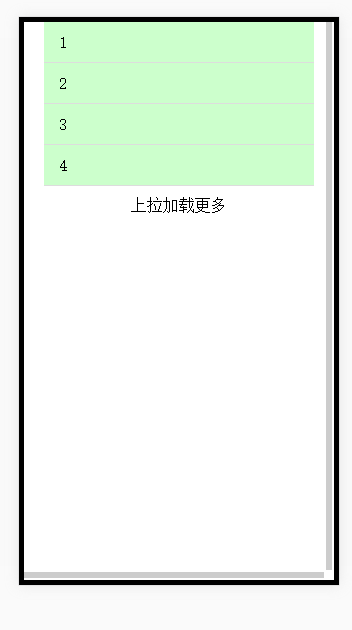

# 基于pull-element的上拉加载更多
上拉加载更多的实现思路虽说是一个挺简单的东西，但是要想用户体验好却不是那么简单。市面上我见到的就是[iscroll](https://github.com/cubiq/iscroll "iscroll") 插件，[refresher](http://www.jq22.com/jquery-info4469 "refresher")插件(基于iscroll)，[better-scroll](https://github.com/feibingbalabala/better-scroll "better-scroll")。这三款不过感觉都挺大的，最主要的是有BUG啊(比如我遇到的就是上拉，当手指移出屏幕以后整个滚动的部分就会弹不回来了，很尴尬)，自己造轮子把，又tm懒。<br />
不过最近遇到了[pull-element](https://github.com/Lucifier129/pull-element "pull-element")这个触摸拖动元素的交互效果，不依赖其他插件，支持上下左右滚动哦。于是我就想改造成自己的轮子把，操起代码就是撸。
看看需要实现的结果：<br />
<br />
HTML：
``` html
<div id="wrap" class="wrap">
    <ul class="content">
        <li>1</li>
        <li>2</li>
        <li>3</li>
        <li>4</li>
    </ul>
    <div class="more-text">上拉加载更多</div>
</div>
```
引入：
```html 
<script type="text/javascript" src="./js/pull-element.js"></script>
<script type="text/javascript" src="./js/jquery.min.js"></script>
```
JS：
``` js
var options = {
   target: "#wrap",
    detectScroll: true, //滚动到边缘之后，才开始拖动元素
    pullUp: true, //上拉
    pullDown: true,  //下拉
    onPullUp: function(data) {
        var translateX = data.translateX;
        var translateY = data.translateY;
        $(".more-text").html("松开即可加载新内容");
    },
    onPullUpEnd: function(data) {
        var translateX = data.translateX;
        var translateY = data.translateY;
        // this.preventDefault(); 阻止target 元素回到原点位置
        $(".more-text").html("<i class='loading'></i>加载中...");
        // 上啦加载更多（做一个小判断。当偏移值超出10的时候，调用请求）
        if(translateY <= -10){
            more();
        }
    } //接受一个参数：data。data 参数包含两个字段，translateX 和 translateY，分别是 X 轴和 Y 轴的偏移值，
};
var pullElement = new PullElement(options);
pullElement.init();
function more() {
    var timer = setTimeout(function(){
        //获取原本的DOM结构
        var content = $(".content").html();
        var newContent = "";
        //这里就可以是ajax的请求了
        for (var i = 0; i <= 3; i++) {
            newContent += "<li>" + i +"</li>"
        };
        //把原本的DOM和请求回来的数据合并起来，当然也可以用jq中的append方法。
        $(".content").html(content+newContent);
        $(".more-text").html("上拉加载更多");
    }, 2000);
}
```
这样就可以实现上拉加载更多的效果了。
整体效果是很流畅的，动画回弹效果体验效果也是很不错的，主要原因是因为**pull-element**是基于CSS3的**transform**属性（translate位移）它不会去触发浏览器的 repaint/reflow（如果使用定位position就会触发，浪费性能），**transform**过渡是由GPU控制，支持硬件加速，并不需要软件方面的渲染。如果在移动端写动画的时候需要尽量去避免在**transform**下使用position的移动，这样你还是会看到卡顿。（这里推荐一片文章 [如丝般顺滑：使用 CSS3 实现 60 帧的动画](http://blog.csdn.net/qq_15096707/article/details/52269725 "如丝般顺滑：使用 CSS3 实现 60 帧的动画")）
在某些浏览器中**transition**的**duration**属性可能是不是正常的工作，pull-element也做了相对应的兼容，使用用setTimeout计时器进行处理。<br />
感觉自己以前一直不明白swiper.js啥的在移动端他们很喜欢使用translate来代替定位的方式进行位置的移动，而且自己写的动画也常常出现卡顿，感觉就是js计时器配合css的变量修改或者transform中position的变化，但一直没办法做到别人的demo那样流畅很是困惑，不过现在对于移动端的动画有了新的认识~。
